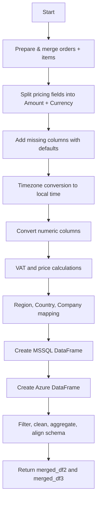

## Amazon Data Processing Pipeline

This document explains, end-to-end, how Amazon order and order-item data is transformed inside the backend data processor. It is written so that a new engineer or analyst can follow each step and understand why it exists and what it produces.

- **Entry point**: `process_amazon_data(orders_data, order_items_data, marketplace_name)`
- **Core class**: `AmazonDataProcessor`
- **Inputs**:
  - **orders_data**: list of order dictionaries (output of Amazon Orders API)
  - **order_items_data**: list of order item dictionaries (output of Amazon Order Items API)
  - **marketplace_name**: one of `UK`, `ES`, `DE`, `IT` (drives timezone and VAT logic)
- **Outputs**:
  - `merged_df2`: MSSQL-formatted DataFrame
  - `merged_df3`: Azure-formatted DataFrame (cleaned, filtered, aggregated)

### High-level flow


---

## 1) Prepare and merge data
Function: `_prepare_dataframes(orders_data, order_items_data)`

- Orders are normalized with `pandas.json_normalize` to flatten nested structures.
- Items are converted with `pandas.DataFrame`.
- Key alignment:
  - Orders must contain `AmazonOrderId`.
  - Items must contain `order_id` (renamed to `AmazonOrderId`).
- Join strategy: outer join on `AmazonOrderId` to retain all records.
- Debug aids (optional artifacts): `orders_df.csv`, `items_df.csv`, `merged_df.csv` are written to help diagnose column shapes.

Result: a single wide `merged_df` combining order-level and item-level fields.

Why: downstream steps (pricing, VAT, Azure/MSSQL exports) expect a unified row set with both order and item context.

---

## 2) Split pricing fields into Amount and Currency
Function: `_split_pricing_columns(df)`

Amazon often returns prices as strings such as "12.01 GBP" (or with no currency, or with negatives). This step standardizes these fields by extracting:
- `<Field>.Amount` (float)
- `<Field>.CurrencyCode` (string)

Applied to these base fields when present:
- `ItemPrice`, `ShippingPrice`, `ItemTax`, `ShippingTax`, `ShippingDiscount`, `ShippingDiscountTax`, `PromotionDiscount`, `PromotionDiscountTax`, `CODFee`, `CODFeeDiscount`, `OrderTotal`

Extraction rules:
- Accepts formats like `12.01 GBP`, `12.01GBP`, `-5.00 USD`, or just `12.01`.
- If currency is missing or value is blank/unparseable, the currency code is left empty `''`.
- Non-numeric or unexpected input is coerced to `0.0` for amount.

Example:
```text
"12.01 GBP" -> Amount: 12.01, CurrencyCode: GBP
"-5.00"     -> Amount: -5.00, CurrencyCode: ''
"" or None  -> Amount: 0.0,  CurrencyCode: ''
```

Why: downstream calculations (VAT, totals) need numeric amounts; currency codes are needed for exports.

---

## 3) Add missing columns
Function: `_add_missing_columns(df)`

Ensures presence of common shipping-related columns with `NaN` defaults when missing:
- `ShippingAddress.County`, `ShippingTax.CurrencyCode`, `ShippingPrice.CurrencyCode`, `ShippingDiscount.CurrencyCode`, `ShippingDiscountTax.CurrencyCode`, `ShippingTax.Amount`, `ShippingPrice.Amount`, `ShippingDiscount.Amount`, `ShippingDiscountTax.Amount`

Why: keeps later selections and renames stable even if upstream responses omit fields.

---

## 4) Timezone conversion
Functions: `_convert_timezone_optimized`, `convert_utc_to_mest`, `convert_utc_to_bst`

- Input: `PurchaseDate` values in UTC.
- Output: `PurchaseDate_conversion` adjusted to local marketplace time.

Marketplace behavior:
- `UK`: converts to BST/GMT (UTC+1 during DST, UTC+0 otherwise).
- `ES`, `DE`, `IT`: convert to MEST/CET (UTC+2 during DST, UTC+1 otherwise).

DST detection:
- DST starts last Sunday of March at 01:00 and ends last Sunday of October at 01:00 (per `last_sunday_of_march` / `last_sunday_of_october`).

Accepted timestamp formats (auto-parsed, with fallback to `pandas.to_datetime`):
- `YYYY-MM-DDTHH:MM:SSZ`
- `YYYY-MM-DDTHH:MM:SS.sssZ`
- `YYYY-MM-DD HH:MM:SS`
- `YYYY-MM-DDTHH:MM:SS`

Why: reporting and aggregation are done in local marketplace time.

---

## 5) Numeric conversions
Function: `_convert_numeric_columns(df)`

Converts the following columns (when present) to numeric using `to_numeric(..., errors='coerce')`:
- `PromotionDiscount.Amount`, `ItemPrice.Amount`, `PromotionDiscountTax.Amount`, `ShippingTax.Amount`, `ShippingPrice.Amount`, `ShippingDiscount.Amount`, `ShippingDiscountTax.Amount`, `ItemTax.Amount`, `OrderTotal.Amount`

Why: ensures consistent numeric types for arithmetic and rounding.

---

## 6) VAT and price calculations
Function: `_calculate_vat_vectorized(df)`

VAT rates and multipliers by marketplace:
- `Amazon.es`: 21% (multiplier 1.21), percentage used for net extraction: 21/121
- `Amazon.de`: 19% (multiplier 1.19), percentage: 19/119
- `Amazon.it`: 22% (multiplier 1.22), percentage: 22/122
- `Amazon.co.uk`: 20% (multiplier 1.20), percentage: 20/120

Notes:
- For each marketplace, a mask selects rows where `SalesChannel` matches the marketplace. The code also treats `SalesChannel == 'Non-Amazon'` as part of the mask, which means non-Amazon rows may be reassigned per marketplace loop; the last processed marketplace will win. If you rely on `Non-Amazon`, validate this behavior for your data.

Derived columns:
- Initialize: `Promotional_Tax`, `vat%`, `Price`, `VAT`, `unit_price(vat_exclusive)`, `item_total` to 0.0
- Fill missing amounts for calculations with 0.0 where needed
- `Promotional_Tax = PromotionDiscount.Amount * multiplier - PromotionDiscount.Amount`
- `vat% = percentage` per marketplace; set to `0` where `ItemTax.Amount == 0`
- If `ItemTax.Amount == 0`, also set `Promotional_Tax = 0`
- `Price = ItemPrice.Amount + Promotional_Tax`
- `VAT = Price * vat%`
- `unit_price(vat_exclusive) = Price - VAT`
- `item_total = Price - PromotionDiscount.Amount - Promotional_Tax`
- Special case: when both `Promotional_Tax == 0` and `PromotionDiscount.Amount == 0`, set `unit_price(vat_exclusive) = Price - ItemTax.Amount`
- Rounding to 2 decimals for: `ItemTax.Amount`, `Promotional_Tax`, `Price`, `unit_price(vat_exclusive)`, `item_total`

Why: standardizes VAT-inclusive and VAT-exclusive pricing and line totals for reporting.

---

## 7) Region, Country, Company, Channel mapping
Function: `_add_region_mapping(df)`

- Adds columns (default empty): `Region`, `Country`, `Company`, and sets `Channel = 'Amazon'`.
- Populates based on `SalesChannel` exact match:
  - `Amazon.co.uk` -> Region `UK`, Country `United Kingdom`, Company `B2Fitinss`
  - `Amazon.es`   -> Region `ES`, Country `Spain`, Company `B2fitness LTD`
  - `Amazon.de`   -> Region `DE`, Country `Germany`, Company `B2Fitinss`
  - `Amazon.it`   -> Region `IT`, Country `Italy`, Company `B2Fitinss`

Why: used by exports and aggregated reporting by market.

---

## 8) Build MSSQL DataFrame (`merged_df2`)
Function: `_create_mssql_dataframe(df)`

- Selects a curated set of order/item/pricing columns.
- Renames for clarity/compatibility:
  - `VAT` -> `calculated_vat`
  - `ItemTax.Amount` -> `vat`
  - `ItemPrice.Amount` -> `item_subtotal`
  - `PromotionDiscount.Amount` -> `promotion`
  - `Price` -> `unit_price(vat_inclusive)`
  - `OrderTotal.CurrencyCode` -> `CurrencyCode`
  - `OrderTotal.Amount` -> `grand_total`
- Adds `PurchaseDate_Materialized` as the date portion of `PurchaseDate_conversion`.

Why: aligns with writing to MSSQL and allows downstream Azure transformation to work with a uniform schema.

---

## 9) Build Azure DataFrame (`merged_df3`)
Functions: `_create_azure_dataframe(merged_df2)`, `_apply_azure_transformations(df)`, `_update_azure_mappings(df)`, `_apply_aggregation(df)`, `_ensure_azure_columns(df)`

### 9.1 Initial selection and derivations
- Selects Azure-focused columns from MSSQL frame.
- Adds derived columns:
  - `ItemTax_Amount = vat`
  - `Total = unit_price(vat_inclusive)`
  - `Promotional_Rebates = promotion`
  - `Channel = SalesChannel` (fallback `'Amazon'` if not present)
- Renames for Azure semantics:
  - `PurchaseDate_conversion` -> `CLEAN_DateTime`
  - `AmazonOrderId` -> `OrderId`
  - `SellerSKU` -> `SKU`
  - `OrderStatus` -> `Type`
  - `QuantityOrdered` -> `Quantity`

### 9.2 Transformations and filtering
- Keep only shipped orders: `Type == 'Shipped'` then map `Type -> 'Order'`
- Convert `CLEAN_DateTime` to datetime and add `Date` (date-only)
- Exclude non-Amazon sales: remove `SalesChannel == 'Non-Amazon'`
- Remove zero-quantity rows: `Quantity != 0`
- Remove rows with null `Total`
- Normalize `SKU`: strip, uppercase
- Update `Channel`, `Company`, `Country` again based on `SalesChannel`

### 9.3 Column selection and aggregation
- Keep a defined set of final columns (subset applied if some are missing).
- Aggregation:
  - Group by keys such as `CLEAN_DateTime`, `Date`, `OrderId`, `SKU`, `Type`, `Region`, `Country`, `SalesChannel`, `Channel`, `MarketplaceId`, `Company`, `CurrencyCode`, `FulfillmentChannel`.
  - Sum numeric measures: `Quantity`, `vat`, `item_subtotal`, `promotion`, `Promotional_Tax`, `unit_price(vat_inclusive)`, `unit_price(vat_exclusive)`, `item_total`, `ItemTax_Amount`, `Total`, `Promotional_Rebates`.
  - Merge back `PurchaseDate` (as `data_fetch_Date`) per `(OrderId, SKU, Region)`.
  - Merge in `grand_total` at order level.
  - Merge in `Title` per `SKU`.
  - Derive per-unit metrics (guarding against divide-by-zero):
    - `per_unit_price(vat_inclusive) = unit_price(vat_inclusive) / Quantity`
    - `per_unit_price(vat_exclusive) = unit_price(vat_exclusive) / Quantity`

### 9.4 Final Azure schema alignment
Function: `_ensure_azure_columns(df)`

- Produces a DataFrame with a consistent set of columns, types, and defaults matching the Azure staging table.
- Ensures dtypes (e.g., `datetime64[ns]`, `float64`, `int64`, `object`) and fills missing columns with appropriate defaults (`0`, `0.0`, `NaT`, or `None`).
- Logs the aligned shape and column list for verification.

Why: guarantees robust loading into Azure even when inputs vary.

---

## Error handling, logging, and performance

- Pandas optimized:
  - `pd.set_option('mode.copy_on_write', True)` to reduce copies.
  - Suppresses some pandas performance warnings for cleaner logs.
- Timezone conversion uses robust parsing with multiple formats and a fallback to `pandas.to_datetime`.
- Vectorized operations are preferred; apply-based fallbacks are used where needed (e.g., timezone conversion).
- Extensive use of `fillna(0)` and `to_numeric(..., errors='coerce')` to keep arithmetic safe.
- Informational logging reports shapes and key milestones (e.g., merge size, final output sizes).

---

## Inputs and outputs at a glance

- Input (function call):
```python
mssql_df, azure_df = process_amazon_data(
    orders_data=orders,         # list[dict]
    order_items_data=items,     # list[dict]
    marketplace_name="UK"       # or "ES" | "DE" | "IT"
)
```

- Output highlights:
  - `mssql_df`: flattened order+item schema with pricing, VAT, and region columns; ready for MSSQL.
  - `azure_df`: cleaned, filtered, aggregated, and schema-aligned to the Azure staging table.

---

## Assumptions and caveats

- `orders_data` include `AmazonOrderId`; `order_items_data` include `order_id`.
- Pricing strings may lack currencies; defaults and empty codes are tolerated.
- `Non-Amazon` rows are currently included in marketplace VAT masks; verify if your data contains such rows and whether they should be excluded earlier.
- DST rules are simplified to last Sundays in March/October at 01:00.
- Some downstream fields are optional; the processor guards against missing columns and proceeds with sensible defaults.

---

## Troubleshooting tips

- Inspect the optional CSVs `orders_df.csv`, `items_df.csv`, `merged_df.csv` for unexpected shapes or column names.
- Check logs for messages like "Merged DataFrame shape" and Azure alignment info to quickly spot mismatches.
- If timezones look off, validate the raw `PurchaseDate` format and the chosen `marketplace_name`.
- If amounts are zeroed, confirm pricing fields were present or not merged as strings that could not be parsed.

---

## Glossary

- **VAT**: Value Added Tax; marketplace-dependent rate.
- **VAT multiplier**: Gross-from-net multiplier (e.g., 1.21 for 21%).
- **`unit_price(vat_inclusive)`**: Line price including VAT and promotional tax.
- **`unit_price(vat_exclusive)`**: Line price excluding VAT.
- **`item_total`**: Final line total after promotions and promotional tax.
- **CLEAN_DateTime**: Localized purchase datetime used for time-based grouping in Azure.
