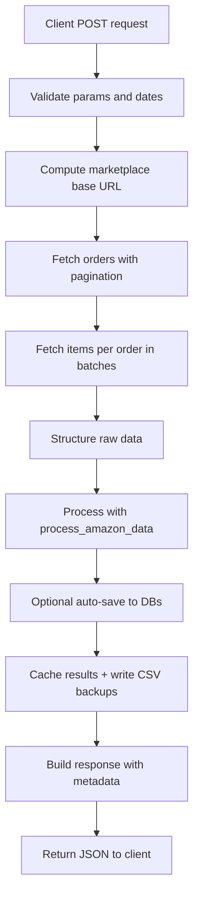
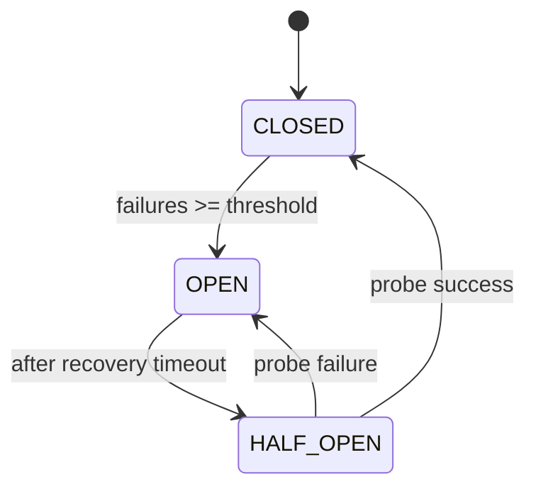

## FetchAmazonDataView - End-to-End Guide

This document explains how `FetchAmazonDataView` fetches Amazon orders and order items, enforces Amazon SP-API rate limits, retries on failures, structures the data, and coordinates processing, caching, and downloads. It is intended for engineers and analysts who need to understand and maintain the fetching pipeline.

- **Main class**: `FetchAmazonDataView` (`backend/amazon_connector/api/views.py`)
- **Primary endpoint**: POST `/api/fetch-amazon-data/` (name may vary in `urls.py`)
- **Related helpers**: token refresh, rate limiter, circuit breaker, batch processing, download/status endpoints

### High-level flow


---

## Endpoints and responsibilities

- **POST Fetch** (main entry): orchestrates full fetch + process + optional save + cache + return.
- **GET DownloadProcessedData**: lists cached keys; POST downloads CSV for `mssql` or `azure` data.
- **GET ProcessedDataStatus**: shows file stats under `processed_data/` (counts, sizes, latest files).
- **POST FetchMissingOrderItems**: targeted recovery for failed orders’ items.

---

## Inputs and request validation (POST fetch)

Expected JSON body:
- **access_token**: Amazon SP-API access token
- **marketplace_id**: Amazon marketplace ID (e.g., `A1F83G8C2ARO7P` for UK)
- **start_date**: ISO 8601 string (`YYYY-MM-DD` or `YYYY-MM-DDTHH:MM:SSZ`)
- **end_date**: ISO 8601 string
- **max_orders**: optional; if omitted, no explicit limit
- **auto_save**: optional boolean; if true, attempts to save processed data to MSSQL/Azure

Validation rules:
- All required fields must be present and non-empty
- Dates are normalized to include `T00:00:00Z` / `T23:59:59Z` if only `YYYY-MM-DD` is provided
- Start date must be before end date
- Date range must not exceed 30 days

Marketplace base URLs (subset):
- `A1F83G8C2ARO7P` (UK) → `https://sellingpartnerapi-eu.amazon.com`
- `A1PA6795UKMFR9` (DE) → EU endpoint
- `APJ6JRA9NG5V4` (IT) → EU endpoint
- `A1RKKUPIHCS9HS` (ES) → EU endpoint
- `ATVPDKIKX0DER` (US) → NA endpoint

---

## Date handling and timezone conversion

Function: `convert_dates(start_date, end_date, marketplace)`
- UK: interprets inputs as Europe/London (BST/GMT handled by `pytz`), converts to UTC `Z`
- Others (EU): interprets inputs as Europe/Paris (MET), converts to UTC `Z`
- Returns ISO strings with `Z` suitable for Amazon SP-API queries

Why: Align Amazon query window with marketplace-local input semantics while sending UTC to SP-API.

---

## Rate limiting, retries, and resilience

### Enhanced token bucket rate limiter
- **Core idea**: Each endpoint has a "bucket" with a maximum capacity (burst limit). Tokens accumulate in the bucket at a steady refill rate (tokens per second). Each outgoing request must acquire one token. If no token is available, the caller waits until enough tokens accumulate.
- **Refill**: Over time, the bucket gains tokens at the configured rate, up to the capacity. This models sustained throughput. For example, at 0.5 req/s the bucket gains one token roughly every 2 seconds.
- **Acquire**: When a request arrives, if `tokens >= 1`, it consumes a token and proceeds immediately. If `tokens < 1`, the caller computes the deficit and sleeps the minimal time needed for the bucket to refill to one token, then proceeds.
- **Burst vs sustained**: Because tokens can accumulate when idle, short bursts are permitted (up to the burst capacity) without violating the long‑term average rate. Under continuous load, the effective rate converges to the refill rate.
- **Concurrency and fairness**: With concurrent callers, the limiter becomes the gatekeeper; those arriving when tokens exist pass, others queue/sleep. Optional priority can slightly bias the wait time, but overall throughput still respects the global limit.
- **Why this fits SP‑API**: Amazon publishes both a rate (tokens per second) and a burst (max tokens). Token bucket directly encodes both guarantees, preventing 429s while allowing short spikes that stay within burst.

### Circuit breaker
- **Problem it solves**: When the downstream system is unhealthy (errors/timeouts), naive retries can amplify load and waste time. A circuit breaker fails fast to contain impact.
- **States and transitions**:
  - **CLOSED**: Normal operation. Count consecutive (or windowed) failures. If failures exceed a threshold, transition to OPEN and record the last failure time.
  - **OPEN**: Short‑circuit new calls immediately (preventing further strain). Remain OPEN until a recovery timeout elapses.
  - **HALF_OPEN**: After the timeout, allow a limited "probe" request. If the probe succeeds, reset counters and move to CLOSED. If it fails, go back to OPEN and restart the cooldown.
- **What counts as failure**: Typically timeouts, 5xx, throttling bursts that persist, or application‑level fatal errors. 4xx validation errors usually do not trip the breaker.
- **Benefits**: Protects resources, reduces tail latency during incidents, and provides a controlled path to recovery via probes instead of unleashing full traffic immediately.

### Retries with backoff and jitter
- **When to retry**: Transient failures such as 429 (rate limit), 5xx/service unavailable, network flaps, or timeouts. Do not retry non‑idempotent or client‑error cases (e.g., invalid parameters).
- **Backoff**: Increase the wait between attempts exponentially to reduce load and allow recovery. A common rule is `delay = base * 2^attempt`, capped by a maximum.
- **Jitter**: Add randomness to the delay to prevent synchronized retry spikes across many workers. Jitter can be full (random between 0 and delay) or additive (± a fraction of delay). This spreads retries over time and reduces herd effects.
- **Error‑aware delays**: Certain categories can scale the backoff (e.g., longer waits for 429/503 than for transient network errors) to respectfully back off from the downstream.
- **Ceilings and limits**: Use a maximum delay and a maximum number of attempts to bound total retry time and avoid stalls.

---

## Fetch workflow

### Step 1: Fetch orders (paginated)
Method: `fetch_all_orders`
- Calls `/orders/v0/orders` with params: `MarketplaceIds`, `CreatedAfter`, `CreatedBefore`, `OrderStatuses`, `MaxResultsPerPage`
- Follows `payload.NextToken` for pagination
- Respects `max_orders` cap if provided

### Step 2: Fetch items for each order
Method: `fetch_order_items_batch`
- Processes orders in small batches (adaptive sizing) with conservative concurrency
- For each batch, calls `_process_order_items_batch` which uses a thread pool to fetch per order
- Collects successes and failures; after main pass, auto-retries failed orders via `fetch_missing_order_items`
- Auto-retry waits briefly, then tries single-order robust fetch to maximize success rate

### Step 3: Structure data
Method: `structure_order_data`
- Returns a dictionary containing:
  - `orders`: array of raw orders, each with nested `items`
  - `order_items`: flat array of all items with `order_id` attached
  - `metadata`: totals and timestamp

---

## Processing, caching, and downloads

### Processing
- Calls `process_amazon_data(orders, order_items, marketplace_name)`
- Produces two DataFrames: `mssql_df` and `azure_df`
- Logs shapes and columns for diagnostics

### Optional auto-save
- If `auto_save` true, uses `save_simple(mssql_df, azure_df, marketplace_id)`
- Captures success and records saved; updates activity status accordingly

### Caching and CSV backups
- Converts DataFrames to records and stores them in an in-memory cache:
  - Key format: `processed_data_{marketplace_id}_{timestamp}`
  - Data includes `mssql_data`, `azure_data`, metadata
- Also writes CSV backups into `processed_data/` directory with filenames like:
  - `MSSQL_data_{marketplace_name}_{YYYYMMDD_HHMMSS}.csv`
  - `AZURE_data_{marketplace_name}_{YYYYMMDD_HHMMSS}.csv`

### Downloading
- `DownloadProcessedDataView` GET: lists cache keys and basic info for each
- `DownloadProcessedDataView` POST: given `cache_key` and `data_type` (`mssql`|`azure`), returns CSV
  - If cache key missing, falls back to most recent CSV on disk (if available)

### Processed data status
- `ProcessedDataStatusView` GET: summarizes available files in `processed_data/` (counts, sizes, latest)

---

## Error handling and user-facing messages

- Comprehensive try/except blocks with JSON error responses and friendly messages
- Differentiates between invalid input, auth errors, rate limits, service unavailability, and unknown issues
- Activity records (if used) are updated with detailed status and messages

---

## Configuration knobs (key attributes)

- `ORDERS_MAX_REQUESTS_PER_SECOND`, `ORDERS_BURST_LIMIT`
- `ORDER_ITEMS_MAX_REQUESTS_PER_SECOND`, `ORDER_ITEMS_BURST_LIMIT`
- `INITIAL_BATCH_SIZE`, `MIN_BATCH_SIZE`, `MAX_BATCH_SIZE`
- `CIRCUIT_BREAKER_FAILURE_THRESHOLD`, `CIRCUIT_BREAKER_RECOVERY_TIMEOUT`
- `MAX_RETRIES`, `BASE_RETRY_DELAY`, `MAX_RETRY_DELAY`, `JITTER_RANGE`
- `REQUEST_TIMEOUT`

These control rate limiting aggressiveness, concurrency, retry behavior, and request timeouts.

---

## Key methods - quick reference

- `post`: main entry to orchestrate the entire operation
- `convert_dates`: normalize local-marketplace dates to UTC `Z`
- `fetch_orders_with_items`: high-level orchestration for orders + items fetching
- `fetch_all_orders`: paginated orders fetch
- `fetch_order_items_batch`: batched items fetch with adaptive behavior
- `fetch_missing_order_items`: targeted recovery for failed orders
- `_process_order_items_batch`: thread-pooled per-order fetch within a batch
- `fetch_single_order_items_with_retry`: resilient per-order items fetch with categorized retries
- `make_rate_limited_request`: wrapper applying rate limits, token refresh, and error handling
- `_refresh_token_and_retry`: synchronized token refresh from `creds.json`
- `structure_order_data`: produce structured payload for downstream processing and clients

---

## Example request/response

Request (POST):
```json
{
  "access_token": "<SP-API access token>",
  "marketplace_id": "A1F83G8C2ARO7P",
  "start_date": "2025-07-01",
  "end_date": "2025-07-15",
  "max_orders": 200,
  "auto_save": true
}
```

Success response (excerpt):
```json
{
  "success": true,
  "message": "Amazon data fetched and processed successfully",
  "data": {
    "orders": [ /* raw Amazon orders with nested items */ ],
    "order_items": [ /* flat list of all items */ ],
    "processed_data": {
      "mssql_records": 1200,
      "azure_records": 950,
      "cache_key": "processed_data_A1F83G8C2ARO7P_1720200000",
      "available_for_download": true,
      "database_save": {
        "attempted": true,
        "success": true,
        "records_saved": 2150
      }
    },
    "metadata": {
      "total_orders_fetched": 200,
      "total_items_fetched": 1400,
      "marketplace_id": "A1F83G8C2ARO7P",
      "marketplace_name": "United Kingdom",
      "date_range": {"start_date": "2025-07-01T00:00:00Z", "end_date": "2025-07-15T23:59:59Z"},
      "fetch_completed_at": "2025-07-16T12:34:56Z",
      "performance": {
        "total_time_seconds": 480.5,
        "fetch_time_seconds": 350.2,
        "processing_time_seconds": 130.3,
        "average_time_per_order": 1.75
      }
    }
  }
}
```

Error response (example):
```json
{
  "success": false,
  "error": "Missing required parameters",
  "details": "Required fields: access_token, marketplace_id, start_date, end_date"
}
```

---

## Glossary

- **Rate limiter (token bucket)**: Controls request rate and allows short bursts
- **Circuit breaker**: Prevents repeated failing calls from overwhelming the system
- **Burst limit**: Max tokens/leeway for short spikes within rate limits
- **Adaptive batch sizing**: Increases/decreases batch size based on success/failure patterns
- **Auto-retry**: Automated re-fetch of failed orders to improve success rate
- **Cache key**: Identifier for in-memory stored processed data for later download

---

## Operational tips

- For long ranges, keep within 30 days and use multiple calls
- Prefer running during off-peak hours to reduce throttling and 503s
- Monitor logs for throttle rate and circuit breaker events
- If items are missing, use the `FetchMissingOrderItems` endpoint to recover
- Ensure `creds.json` is present and valid for token refresh during long runs

---

## Deep dive: core logics and how they work

### 1) Request construction and parameter normalization

- Date normalization to ISO with Z suffix and marketplace-specific timezone handling happens before querying SP-API. When only a date is supplied, hours are expanded to cover the full day.

Code reference (normalizing input dates, then converting by marketplace):
```1117:1135:/home/a-h-m-a-r/Desktop/Amazon Connector/amazon-connector/backend/amazon_connector/api/views.py
            try:
                // ... existing code ...
                if 'T' not in start_date:
                    start_date = f"{start_date}T00:00:00Z"
                if 'T' not in end_date:
                    end_date = f"{end_date}T23:59:59Z"
                // ... existing code ...
                if marketplace_id == "A1F83G8C2ARO7P":
                    start_dt_str, end_dt_str = self.convert_dates(start_date, end_date, "UK")
                else:
                    start_dt_str, end_dt_str = self.convert_dates(start_date, end_date, "IT")
                start_dt = datetime.fromisoformat(start_dt_str.replace('Z', ''))
                end_dt = datetime.fromisoformat(end_dt_str.replace('Z', ''))
```

- Headers include `x-amz-access-token`, `x-amz-date`, and a `User-Agent`. The base URL is selected by marketplace ID.

### 2) Token bucket rate limiting (orders and items)

Concept: Each limiter has a bucket with a capacity equal to the burst limit. Tokens refill over time at `rate_limit` tokens/sec. A request requires 1 token; if none available, the caller waits.

Formula:
- Refill: `tokens = min(burst_limit, tokens + (now - last_update) * rate_limit)`
- Acquire: if `tokens < 1`, compute wait time `((1 - tokens) / rate_limit)`, then sleep; else `tokens -= 1`
- Priority adjusts wait slightly for high/low importance calls.

Code reference:
```909:960:/home/a-h-m-a-r/Desktop/Amazon Connector/amazon-connector/backend/amazon_connector/api/views.py
            self.tokens = min(float(self.burst_limit), self.tokens + new_tokens)
            // ... existing code ...
                if self.tokens < 1.0:
                    base_wait_time = (1.0 - self.tokens) / self.rate_limit
                    if priority == "high":
                        wait_time = base_wait_time * 0.9
                    elif priority == "low":
                        wait_time = base_wait_time * 1.2
                    else:
                        wait_time = base_wait_time
                    time.sleep(wait_time)
                    self.tokens = 0.0
                else:
                    self.tokens -= 1.0
```

Why this matters: Amazon enforces strict throughput limits. The limiter ensures we do not exceed rates while still allowing short bursts up to the documented burst caps.

### 3) Circuit breaker (protect against cascaded failures)

States and transitions:
- CLOSED: normal operation; count failures. If `failure_count >= failure_threshold`, transition → OPEN
- OPEN: block calls immediately. After `recovery_timeout`, transition → HALF_OPEN
- HALF_OPEN: allow a probe call; if it succeeds → CLOSED and reset counters; if fails → OPEN again

Code reference:
```981:1019:/home/a-h-m-a-r/Desktop/Amazon Connector/amazon-connector/backend/amazon_connector/api/views.py
            if self.state == "OPEN":
                if self.last_failure_time is not None and time.time() - self.last_failure_time > self.recovery_timeout:
                    self.state = "HALF_OPEN"
                else:
                    raise Exception("Circuit breaker is OPEN")
            // ... existing code ...
                    if self.failure_count >= self.failure_threshold:
                        self.state = "OPEN"
```

Why this matters: When downstream (Amazon) is unstable, failing fast prevents wasted work and rapid error amplification.

### 4) Paginated orders fetching

- We call `/orders/v0/orders` with parameters and follow `payload.NextToken` until exhausted.
- `MaxResultsPerPage` is set to 100 (Amazon’s maximum), balancing throughput with response size.

Code reference:
```1663:1709:/home/a-h-m-a-r/Desktop/Amazon Connector/amazon-connector/backend/amazon_connector/api/views.py
                params = {
                    'MarketplaceIds': marketplace_id,
                    'CreatedAfter': start_date,
                    'CreatedBefore': end_date,
                    'OrderStatuses': 'Shipped,Unshipped,PartiallyShipped,Canceled,Unfulfillable',
                    'MaxResultsPerPage': 100
                }
                // ... existing code ...
                next_token = payload.get('NextToken')
                if not next_token:
                    break
```

### 5) Batched item fetching with conservative concurrency

- Orders are split into batches (initial size small). Each batch fetches items with a thread pool.
- Concurrency is intentionally conservative to avoid exceeding item endpoint limits.

Code reference:
```2161:2186:/home/a-h-m-a-r/Desktop/Amazon Connector/amazon-connector/backend/amazon_connector/api/views.py
        max_workers = min(2, len(batch))
        with ThreadPoolExecutor(max_workers=max_workers) as executor:
            future_to_order = {
                executor.submit(
                    self.fetch_single_order_items_with_retry,
                    headers, base_url, order
                ): order for order in batch
            }
```

### 6) Adaptive batch sizing

- Increase rule: If failure rate in a batch < 10% for 3 consecutive batches and not at cap, increase batch size by 1
- Decrease rule: If we see 2 consecutive batch failures, decrease batch size by 1 (not below minimum)

Code reference:
```2542:2569:/home/a-h-m-a-r/Desktop/Amazon Connector/amazon-connector/backend/amazon_connector/api/views.py
        failure_rate = len(batch_failures) / batch_size if batch_size > 0 else 0
        if failure_rate < 0.1:
            self.consecutive_batch_successes += 1
            if self.consecutive_batch_successes >= 3 and self.current_batch_size < self.MAX_BATCH_SIZE:
                self.current_batch_size = min(self.current_batch_size + 1, self.MAX_BATCH_SIZE)
        // ... existing code ...
        if self.consecutive_batch_failures >= 2 and self.current_batch_size > self.MIN_BATCH_SIZE:
            self.current_batch_size = max(self.current_batch_size - 1, self.MIN_BATCH_SIZE)
```

Why this matters: We adapt to observed reliability without guesswork, leaning conservative under stress.

### 7) Intelligent retries with exponential backoff + jitter

- Attempts: up to `MAX_RETRIES`
- Base delay: `BASE_RETRY_DELAY * 2^attempt`
- Jitter: ±`JITTER_RANGE` of the base delay to avoid thundering herds
- Error-aware scaling: multiply delay for `rate_limit` (×3), `authentication` (×2), `service_unavailable` (×2), `network` (×1.5)
- Non-retryable: 400/bad request → fail fast

Code reference:
```2251:2266:/home/a-h-m-a-r/Desktop/Amazon Connector/amazon-connector/backend/amazon_connector/api/views.py
                    base_delay = self.BASE_RETRY_DELAY * (2 ** attempt)
                    jitter = base_delay * self.JITTER_RANGE * (random.random() * 2 - 1)
                    retry_delay = min(base_delay + jitter, self.MAX_RETRY_DELAY)
                    if error_type == "rate_limit":
                        retry_delay *= 3
                    elif error_type == "authentication":
                        retry_delay *= 2
                    elif error_type == "service_unavailable":
                        retry_delay *= 2
                    elif error_type == "network":
                        retry_delay *= 1.5
```

### 8) Token refresh with synchronization and cooldown

- If 401/403 occurs, we attempt a token refresh. A short cooldown prevents redundant refresh storms.
- A lock (`token_refresh_lock`) ensures only one thread refreshes at a time. Others read the updated token from `creds.json`.

Code reference (cooldown + synchronized refresh):
```2395:2446:/home/a-h-m-a-r/Desktop/Amazon Connector/amazon-connector/backend/amazon_connector/api/views.py
        if current_time - self.last_token_refresh_time < self.token_refresh_cooldown:
            // read current token from creds.json and reuse
        with self.token_refresh_lock:
            if current_time - self.last_token_refresh_time < self.token_refresh_cooldown:
                // reuse refreshed token
            // proceed to refresh via LWA token endpoint
```

### 9) Error mapping for user-friendly responses

- API error payloads are mapped into human-readable categories: `InvalidInput`, `Unauthorized`, `Forbidden`, `NotFound`, `TooManyRequests`, defaulting to a generic message.

Code reference:
```2649:2689:/home/a-h-m-a-r/Desktop/Amazon Connector/amazon-connector/backend/amazon_connector/api/views.py
                if error_code == 'InvalidInput':
                    user_error = 'Invalid parameters provided'
                elif error_code == 'Unauthorized':
                    user_error = 'Authentication failed'
                elif error_code == 'Forbidden':
                    user_error = 'Access denied'
                elif error_code == 'NotFound':
                    user_error = 'Resource not found'
                elif error_code == 'TooManyRequests':
                    user_error = 'Rate limit exceeded'
```

### 10) Caching structure and CSV fallback

- In-memory cache key: `processed_data_{marketplace_id}_{timestamp}` stores `mssql_data`, `azure_data`, and metadata.
- If a download request references a missing cache key, the system falls back to the most recent on-disk CSV in `processed_data/` matching `MSSQL_data_*.csv` or `AZURE_data_*.csv`.

Code reference (fallback selection):
```2863:2883:/home/a-h-m-a-r/Desktop/Amazon Connector/amazon-connector/backend/amazon_connector/api/views.py
                        files = list(processed_dir.glob(pattern))
                        if files:
                            latest_file = max(files, key=lambda x: x.stat().st_ctime)
                            df = pd.read_csv(latest_file)
                            csv_content = df.to_csv(index=False, encoding='utf-8')
```

### 11) Response metadata and performance metrics

- Performance block includes total/fetch/processing times and estimated split for orders vs items.
- Average time per order helps benchmark end-to-end throughput over the selected window.

Code reference:
```1384:1391:/home/a-h-m-a-r/Desktop/Amazon Connector/amazon-connector/backend/amazon_connector/api/views.py
                            'performance': {
                                'total_time_seconds': round(fetch_duration + processing_duration, 2),
                                'fetch_time_seconds': round(fetch_duration, 2),
                                'processing_time_seconds': round(processing_duration, 2),
                                'orders_fetch_time_seconds': round(fetch_duration * 0.6, 2),
                                'items_fetch_time_seconds': round(fetch_duration * 0.4, 2),
                                'average_time_per_order': round(avg_time_per_order, 4)
                            }
```

### 12) Circuit breaker state diagram



---

## Practical guidance for tuning

- If you encounter frequent 429s, consider lowering `MAX_BATCH_SIZE` and/or increasing `BASE_RETRY_DELAY`.
- If the circuit breaker often opens, lengthen `CIRCUIT_BREAKER_RECOVERY_TIMEOUT` to give Amazon more recovery time.
- If end-to-end runs are too slow but stable, consider raising `INITIAL_BATCH_SIZE` by 1 and monitor failure rates.
- Always keep `REQUEST_TIMEOUT` aligned with observed SP-API latency; too low will inflate timeouts, too high will slow failure detection.
