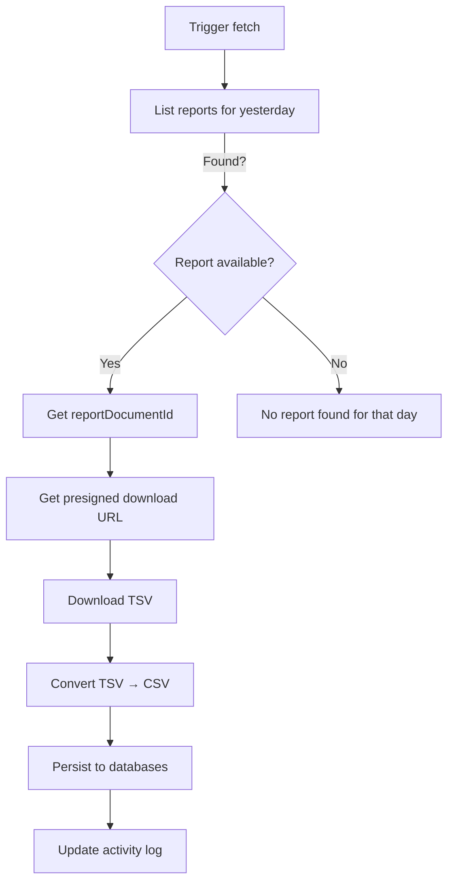

## Inventory Business Logic (FBA) – End-to-End Guide

This document explains how the system fetches and manages Amazon FBA inventory data using the Selling Partner API (SP‑API), how we store it, and how you can operate and troubleshoot it. It is written for both non‑technical and technical readers.

---

## What this is and why it matters

- **Goal**: Maintain daily snapshots of your FBA inventory (what you have, where it is, whether it’s sellable, reserved, inbound, etc.).
- **Why daily**: Amazon’s inventory is constantly changing. If you want to answer questions like “What did we have yesterday?” or “How did stock change over time?”, you need a daily record, not just a current snapshot.
- **Source of truth**: We use the Amazon SP‑API inventory report `GET_FBA_MYI_ALL_INVENTORY_DATA`, which is Amazon’s canonical report for FBA inventory details.

---

## High-level flow (from request to database)

Where this lives in code:
- Django view: `FetchInventoryReportView` in `backend/amazon_connector/api/inventory_views.py`
- Helpers inside the same file: HTTP calls to SP‑API, download and file conversion, database persistence calls
- Database writers: `save_inventory_report_to_mssql`, `save_inventory_report_to_azure` (invoked from `inventory_views.py`)

---

## Key capabilities

- **Fetch yesterday’s report per marketplace**: Attempts to locate a report created yesterday and download it.
- **Multi‑market support**: IT, DE, UK are supported out of the box (can be extended).
- **File handling**: Downloads Amazon’s TSV and converts to CSV for easier downstream use.
- **Persistence**: Saves to MSSQL and Azure data stores via dedicated helpers.
- **Activity tracking**: Records an activity for each fetch attempt with status, counts, and timings.
- **Scheduling support**: Endpoints to create, list, and cancel SP‑API report schedules so Amazon creates reports automatically for you every day.

---

## For non‑technical readers: how to think about it

- Amazon generates inventory files (“reports”). We ask Amazon for the report that was created yesterday. If it exists, we download it and save it.
- If Amazon did not create a report yesterday, we won’t have a file for yesterday. That’s why schedules are important: they tell Amazon to automatically create a report every day.
- The downloaded file is transformed into a spreadsheet format and saved to our databases for analysis and dashboards.
- If something goes wrong (e.g., Amazon is busy), the system waits, tries again carefully, and avoids hammering Amazon to keep things reliable.

---

## For technical readers: detailed behavior

### Report type and endpoints
- **Report type**: `GET_FBA_MYI_ALL_INVENTORY_DATA` (FBA inventory details)
- **Key endpoints used**:
  - List reports: `GET /reports/2021-06-30/reports`
  - Report details: `GET /reports/2021-06-30/reports/{reportId}`
  - Report document: `GET /reports/2021-06-30/documents/{reportDocumentId}`
  - Report schedules: `POST/GET/DELETE /reports/2021-06-30/schedules`

### Date strategy (yesterday)
- We constrain to the previous calendar day in UTC for “yesterday” snapshots.
- Important: Amazon cannot create a report “as of” yesterday on demand. You can only download a report that was actually created yesterday.
- Therefore, production setups should create a daily report schedule so that a report exists each day.

### Current implementation notes
- The view computes `created_after` and `created_before` for yesterday and calls `fetch_reports(created_after, created_before)`.
- Ensure that `createdSince` and `createdUntil` are passed through to the List Reports call. If they are not, results may include reports outside the desired day. Keep this aligned with Amazon’s parameters.

### File handling
- Amazon serves a presigned URL for the report document. We download the TSV to `processed_data/inventory_reports/` and convert to CSV.
- CSV is encoded in UTF‑8 and saved alongside the original TSV for traceability.

### Data persistence
- After conversion, the system attempts to save the report to MSSQL and Azure via:
  - `save_inventory_report_to_mssql(csv_path, latest_report, marketplace_code, items_count)`
  - `save_inventory_report_to_azure(csv_path, latest_report, marketplace_code, items_count)`
- Each saver is responsible for schema mapping and upserts/inserts.

### Activity tracking
- For each marketplace run, an `Activities` record is created and later updated with:
  - `status`: in_progress → completed/failed
  - `items_fetched`: number of rows written
  - `duration_seconds`: end‑to‑end processing time
  - `error_message`: set if failures occur

### Rate limiting and resilience (summary)
- Calls are spaced to respect SP‑API limits (slow request pacing plus per‑request sleeps).
- Use token bucket concepts and conservative pacing to avoid 429 Too Many Requests.
- When Amazon is unstable, we avoid rapid repeated failures by spacing calls and failing fast rather than compounding issues.

---

## What’s inside the FBA inventory report (typical columns)

Although Amazon’s exact columns can evolve, the FBA inventory report commonly includes:
- **Identifiers**: `seller-sku`, `fnsku`, `asin`, `fulfillment-center-id`
- **Condition & status**: `condition`, `product-name`, `status`
- **Quantities**:
  - `available`: units available to sell
  - `reserved`: units reserved (customer orders, FC processing)
  - `inbound`: inbound shipments not yet received
  - `researching` / `unsellable`: problem stock
  - `working`, `receiving`, `shipped`: supply chain stages
- **Aging and location**: aged buckets, FC or site indicators (if present)

How we use them:
- We store the raw data per day per marketplace.
- Downstream analytics can compute sellable stock, reserved ratios, inbound coverage, and stock health trends.

---

## Scheduling daily reports (recommended)

- Create a schedule so Amazon generates a new inventory report every day (or desired cadence). The system provides endpoints to:
  - **Create** a schedule: set `reportType`, `marketplaceIds`, and `period` (e.g., `PT24H`). Optionally specify the next creation time and a local time zone.
  - **List** schedules: confirm schedules exist and review their parameters.
  - **Cancel** schedules: disable a schedule by ID if no longer needed.
- This ensures a report exists for each day, enabling true day‑over‑day inventory history.

---

## Operational lifecycle

1) A job (or a user) triggers the fetch endpoint (typically daily).
2) The system lists reports limited to yesterday’s window and selects the most recent report within that day.
3) It obtains the `reportDocumentId`, fetches the presigned URL, and downloads the TSV.
4) The TSV is converted to CSV and stored on disk; then the CSV content is written to MSSQL and Azure.
5) The activity record is updated with counts, status, and timings; logs capture relevant API payloads and responses for diagnosis.

---

## Error handling and troubleshooting

- **No report found for yesterday**: Confirm a schedule exists and was active. If not, create one and allow at least one full cycle.
- **429 Too Many Requests**: Reduce concurrency and respect pacing; try again later. Ensure burst and sustained rates align with Amazon’s published limits.
- **Timeouts or 5xx**: Amazon might be degraded. Try later; avoid tight retry loops to prevent amplification.
- **CSV empty or malformed**: Check that the TSV actually contains rows and that conversion parameters (delimiter, encoding) are correct.
- **Database write errors**: Validate connection strings and table schemas in the saver helpers.

---

## Configuration and extensibility

- **Marketplaces**: Controlled by `MARKETPLACE_IDS` mapping in `inventory_views.py`. Add or adjust codes as needed.
- **Regions**: Derived from marketplace → region helper; extend when adding new markets.
- **Storage paths**: Files under `processed_data/inventory_reports/`. Ensure the directory is writable where the app runs.
- **Database schemas**: Owned by the saver helpers. Align columns with the report and your BI needs.
- **Scheduling cadence**: Choose `period` (ISO 8601 duration, e.g., `PT24H`) to match business cadence.

---

## Security and credentials

- Credentials are loaded from `creds.json` and used to obtain a short‑lived SP‑API access token.
- Protect `creds.json` with appropriate file permissions and do not commit it.
- Rotate credentials periodically and monitor token expiry.

---

## Known limitations and notes

- Amazon cannot generate a report retroactively “as of” a past date. Daily history depends on report schedules or manual daily generation.
- Ensure the List Reports call applies the `createdSince`/`createdUntil` parameters for reliable day filtering.
- Very large reports can take noticeable time to download and convert; streaming download is used to avoid memory spikes.

---

## FAQs

- **Q: Can I get the inventory state for last week if no reports were created then?**
  - A: No. You can only download reports that were actually created on those days. Set up schedules to avoid gaps.

- **Q: Why do we convert to CSV?**
  - A: CSV is widely compatible with BI tools, databases, and spreadsheets; it simplifies downstream processing.

- **Q: What if I need both current and historical snapshots?**
  - A: Keep the schedule running for history, and you can also generate an on‑demand report for the latest state when needed.

- **Q: How are errors surfaced?**
  - A: The API responds with structured JSON indicating success/failure, and activity records capture details. Application logs include diagnostic data.

---

## Quick reference – related endpoints

- `POST` Fetch Inventory (yesterday): Orchestrates the end‑to‑end fetch for the previous day per selected marketplaces.
- `GET` Fetch Inventory (status): Returns configuration, limits, and supported report type.
- `POST` Create Report Schedule: Creates an SP‑API schedule for the report.
- `GET` Get Report Schedules: Lists schedules with optional filters.
- `DELETE` Cancel Report Schedule: Cancels a schedule by ID.

---

## Success criteria

- A daily CSV per marketplace exists on disk and in databases, with a corresponding activity record marked completed.
- Logs show healthy pacing (no persistent 429s) and successful document downloads.
- Schedules exist and produce a fresh report every day, eliminating coverage gaps.

